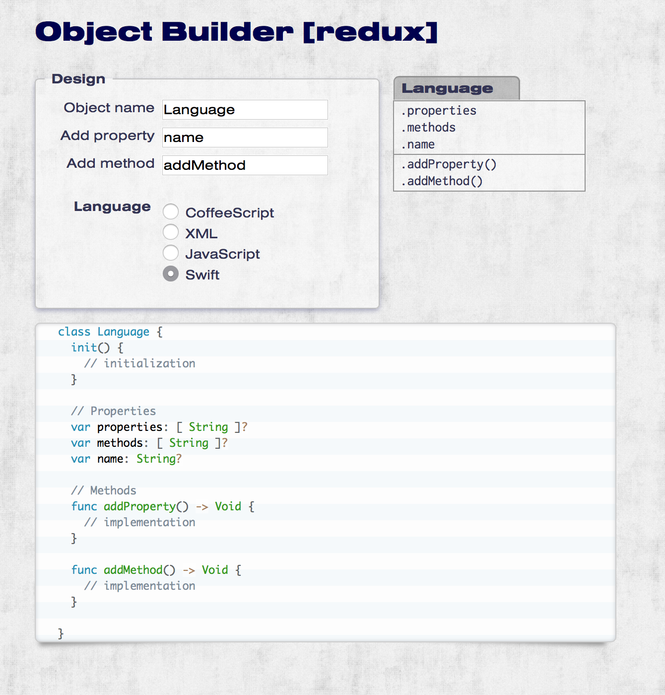

#  Object Builder [ReDuX]

This is a complete rebuild of an [old tool][OBJBUILDER1] I built many *centenniae* ago.
This time with [CoffeeScript][COFFEE], [LESS][], [Kit][KIT], [Eco templates][ECO] and [PrismJS][PRISM].

The [online version][OBJBUILDERRDX] is up there as well; it looks something like this:



[OBJBUILDER1]: http://greystate.dk/resources/objectbuilder/
[OBJBUILDERRDX]: http://greystate.dk/resources/objredux/
[COFFEE]: http://coffeescript.org/
[LESS]: http://lesscss.org/
[KIT]: http://incident57.com/codekit/kit.php
[ECO]: https://github.com/sstephenson/eco/
[PRISM]: http://prismjs.com/

## Installation

To run the app you'll need a webserver of some sorts. I used to use [Pow](http://pow.cx/) because it's dead simple to setup
on a new machine. Pow automatically serves static files in the `public` directory so once you've configured the app
as a Pow site it should be working. Nevertheless, since **CodeKit 2** was released, I've been using its internal web server though, since it's one less thing to worry about.

I use the *Nimbus Sans Extended* font from [Typekit](http://typekit.com/) so you'll have to configure your own Typekit
account if you want to use that. You'll need to replace the script in the `_type.kit` file (or directly in `index.html`)
with your own Typekit code.

## Development

For development I use [TextMate](http://macromates.com/) and [CodeKit](http://incident57.com/codekit/) - CodeKit does
the on-the-fly compilation of LESS, CoffeeScript and Kit files, whenever I save one of those.

The miscellaneous outputs (languages) are rendered using [Eco](https://github.com/sstephenson/eco#eco-embedded-coffeescript-templates) templates which are compiled with a Cake command:

```bash
> cake eco:compile
```

## Todo

- [ ] Add a **Copy Code** button to the output
- [ ] Add a way to save an object and create others


## Credits

* Background graphic from [Subtle Patterns](http://subtlepatterns.com/grunge-wall/)